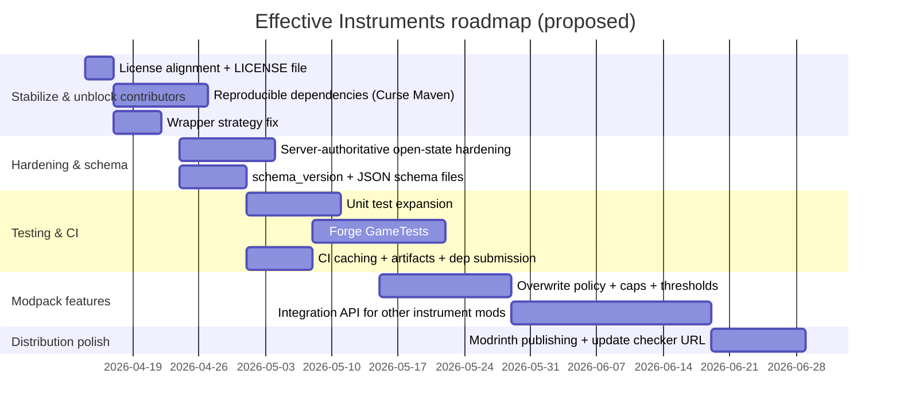

# Effective Instruments Improvement Research Report

## Executive summary

Effective Instruments is a small-but-serious addon mod for entity["video_game","Minecraft","java edition sandbox game"] that layers a configurable “play music → grant buffs” aura system on top of existing instrument mods (notably Genshin Instruments, with optional Even More Instruments support). Its core value proposition—data-driven aura presets + instrument-to-aura mapping + clean buff application/cleanup + a compact in-screen selector overlay—is strong and already aligned with modpack developer workflows. citeturn23view1turn19search2

The largest improvement opportunities cluster into four buckets:

1. **Build + release engineering**: eliminate local-jar build coupling by switching to a reproducible dependency strategy (e.g., Curse Maven), fix Gradle wrapper expectations, tighten CI security, and add a consistent publishing path (GitHub Releases + CurseForge + Modrinth). citeturn12view0turn7search1turn8search3turn19search2  
2. **Schema + data lifecycle**: formalize aura JSON and mapping JSON with explicit schema versioning, validation, and migration, and offer pack-friendly distribution options (so modpacks can ship presets without first-run generation). citeturn6search0turn12view0  
3. **Compatibility + hardening**: clarify and strengthen what “other instrument mods” support really means, harden server-side trust boundaries around client packets, and design an integration interface for non-Genshin-instrument ecosystems. citeturn4view0turn23view1  
4. **Testing + QA**: expand unit tests into schema/validation and aura runtime logic; add Forge GameTests for real in-game verification; wire tests into CI and produce stable artifacts plus changelog provenance. citeturn6search3turn7search0turn7search1

The roadmap section below prioritizes concrete changes with effort/risk estimates and includes actionable snippets (refactors, CI examples, test scaffolding, packaging checklists, KPIs).

## Assumptions and unspecified details

**Enabled connectors**
- Enabled connector(s): **GitHub** only (as requested). Repository scope restricted to `otectus/EffectiveInstruments` only.

**Observed public release context (time-sensitive)**
- CurseForge listing indicates Effective Instruments is a Forge mod for Minecraft 1.20.1 and shows a recent 1.2.0 file (Mar 23, 2026) plus project metadata (license field set to GPLv3 on CurseForge). citeturn23view1turn19search2  
- Dependencies shown publicly for the ecosystem: Genshin Instruments and Even More Instruments are GPLv3 and have large download footprints (useful as a signal for compatibility expectations and support burden). citeturn2view1turn11view1turn23view1

**Unspecified / treated as open**
- **Target loader(s)** beyond Forge: unspecified. Current releases appear Forge-focused; multi-loader support (Fabric/NeoForge) is an optional strategic direction, not assumed. citeturn23view1  
- **Target Minecraft versions** beyond 1.20.1: unspecified. The ecosystem has moved into 1.21.x for related mods, so forward-port planning matters, but no constraint was provided. citeturn2view1turn11view1  
- **Publishing targets** beyond CurseForge: unspecified (but Modrinth + GitHub Releases are high-leverage). Forge has an update-check mechanism that can be fed by Modrinth automatically if desired. citeturn13search0turn13search4  
- **Balance philosophy**: unspecified (power fantasy vs. progression-gated vs. cosmetic). Recommendations assume modpack configurability is paramount (default safe; pack authors can crank it).

**Note on prior internal analysis**
- A user-provided enhancement draft contains additional feature and UX ideas (schema file, schema_version, debug tooling, anti-exploit knobs, etc.) that are folded in and validated/expanded here. fileciteturn0file0L191-L214

## Repository inventory and gap map

### High-level structure

The repository is a conventional ForgeGradle layout: Gradle build scripts + Java sources under `src/main/java` and resources under `src/main/resources`, plus a small unit test set and a GitHub Actions workflow.

### File inventory

The table below is an **exhaustive inventory based on repository inspection**, grouped by function (build/CI, docs, source, resources, tests, tooling). Where a file is **expected but absent**, it is explicitly marked.

#### Build, Gradle, and CI

| Path | Type | Purpose | Improvement notes |
|---|---|---|---|
| `build.gradle` | Gradle build | Build config, dependencies, run configs | Make builds reproducible (remove local jar coupling; add dependency repos; lock versions; add publishing tasks). citeturn12view0turn6search1turn9search1 |
| `settings.gradle` | Gradle | Plugin management / project name | Ensure ForgeGradle plugin repo + toolchain resolver are configured sanely. citeturn6search1 |
| `gradle.properties` | Properties | Version + mod metadata inputs | Align versioning with releases; enforce single source of truth for version + license + URLs. citeturn13search0turn13search4 |
| `gradlew` | Script | Gradle wrapper launcher (POSIX) | Wrapper jar handling must be consistent; see notes below. |
| `gradlew.bat` | Script | Gradle wrapper launcher (Windows) | Same as above. |
| `gradle/wrapper/gradle-wrapper.properties` | Properties | Wrapper distribution URL | Improve wrapper integrity + CI validation and stop ignoring wrapper jar if using wrapper. citeturn7search1turn8search3 |
| `.github/workflows/build.yml` | CI | GitHub Actions build/test pipeline | Add caching, wrapper validation, security hardening, dependency submission, test matrix. citeturn7search1turn8search3turn8search5 |
| **(missing)** `gradle/wrapper/gradle-wrapper.jar` | Binary (expected) | Required for `./gradlew` wrapper execution | If wrapper is used, the jar must be in-repo; don’t `.gitignore` it. Otherwise, remove wrapper scripts and document “system gradle required.” |

#### Documentation and metadata

| Path | Type | Purpose | Improvement notes |
|---|---|---|---|
| `README.md` | Markdown | Primary repo entry docs | Add dev setup, troubleshooting, compatibility truth table, security notes, and contribution links. citeturn17search10 |
| `CURSEFORGE_DESCRIPTION.md` | Markdown | CurseForge body content | Keep as source-of-truth for store page; generate from a single doc to avoid drift. citeturn23view1 |
| `CHANGELOG.md` | Markdown | Release notes | Adopt a standard (Keep a Changelog) + link commits; automate release notes generation. |
| `INSTRUMENT_AURAS.md` | Markdown | Aura/instrument mapping reference | Consider generating this from the JSON mapping + aura presets; keep consistent with in-game readme generation. |
| `.gitignore` | Text | VCS ignore rules | If wrapper jar is ignored, wrapper-based builds will break for contributors. Decide and fix. |

#### Tooling

| Path | Type | Purpose | Improvement notes |
|---|---|---|---|
| `tools/generate_aura_icons.py` | Python | Generates 16×16 aura icons | Add a deterministic pipeline (pinned Pillow version), CI check to ensure generated icons match committed files, and an asset license header. |

#### Source code (Java)

**Core mod**
- `src/main/java/com/crims/effectiveinstruments/EffectiveInstrumentsMod.java`

**Aura system**
- `src/main/java/com/crims/effectiveinstruments/aura/AuraPreset.java`
- `src/main/java/com/crims/effectiveinstruments/aura/AuraRegistry.java`
- `src/main/java/com/crims/effectiveinstruments/aura/AuraJsonLoader.java`
- `src/main/java/com/crims/effectiveinstruments/aura/AuraManager.java`
- `src/main/java/com/crims/effectiveinstruments/aura/InstrumentAuraMapping.java`

**Config**
- `src/main/java/com/crims/effectiveinstruments/config/EIClientConfig.java`
- `src/main/java/com/crims/effectiveinstruments/config/EIServerConfig.java`

**Networking**
- `src/main/java/com/crims/effectiveinstruments/network/EIPacketHandler.java`
- `src/main/java/com/crims/effectiveinstruments/network/packet/SelectAuraC2SPacket.java`
- `src/main/java/com/crims/effectiveinstruments/network/packet/InstrumentOpenC2SPacket.java`
- `src/main/java/com/crims/effectiveinstruments/network/packet/SyncAuraSelectionS2CPacket.java`

**Events**
- `src/main/java/com/crims/effectiveinstruments/event/InstrumentStateHandler.java`
- `src/main/java/com/crims/effectiveinstruments/event/NoteActivityHandler.java`

**Commands**
- `src/main/java/com/crims/effectiveinstruments/command/EICommands.java`

**Client UI & rendering**
- `src/main/java/com/crims/effectiveinstruments/client/event/EIClientSetup.java`
- `src/main/java/com/crims/effectiveinstruments/client/event/AuraOverlayInjector.java`
- `src/main/java/com/crims/effectiveinstruments/client/widget/AuraSelectorWidget.java`
- `src/main/java/com/crims/effectiveinstruments/client/widget/AuraButtonWidget.java`
- `src/main/java/com/crims/effectiveinstruments/client/particle/AuraNoteParticle.java`
- `src/main/java/com/crims/effectiveinstruments/client/particle/AuraNoteParticleProvider.java`

**Particles**
- `src/main/java/com/crims/effectiveinstruments/particle/EIParticleTypes.java`
- `src/main/java/com/crims/effectiveinstruments/particle/AuraNoteParticleOptions.java`

#### Resources and assets

**Forge metadata**
- `src/main/resources/META-INF/mods.toml`
- `src/main/resources/pack.mcmeta` (pack_format present; pack_format mapping matters for MC versioning) citeturn14search0

**Localization**
- `src/main/resources/assets/effectiveinstruments/lang/en_us.json`

**Particles**
- `src/main/resources/assets/effectiveinstruments/particles/aura_note.json`

**Textures: aura icons (GUI)**
- `src/main/resources/assets/effectiveinstruments/textures/gui/aura_zephyrs_blessing.png` fileciteturn60file0L1-L1  
- `src/main/resources/assets/effectiveinstruments/textures/gui/aura_zephyrs_blessing_selected.png` fileciteturn76file0L1-L1  
- `src/main/resources/assets/effectiveinstruments/textures/gui/aura_echoes_of_antiquity.png`
- `src/main/resources/assets/effectiveinstruments/textures/gui/aura_echoes_of_antiquity_selected.png`
- `src/main/resources/assets/effectiveinstruments/textures/gui/aura_bloom_veil.png`
- `src/main/resources/assets/effectiveinstruments/textures/gui/aura_bloom_veil_selected.png`
- `src/main/resources/assets/effectiveinstruments/textures/gui/aura_warcry_cadence.png`
- `src/main/resources/assets/effectiveinstruments/textures/gui/aura_warcry_cadence_selected.png`
- `src/main/resources/assets/effectiveinstruments/textures/gui/aura_moonlit_passage.png`
- `src/main/resources/assets/effectiveinstruments/textures/gui/aura_moonlit_passage_selected.png`
- `src/main/resources/assets/effectiveinstruments/textures/gui/aura_sunkissed_serenade.png`
- `src/main/resources/assets/effectiveinstruments/textures/gui/aura_sunkissed_serenade_selected.png`
- `src/main/resources/assets/effectiveinstruments/textures/gui/aura_rhythm_of_the_earth.png`
- `src/main/resources/assets/effectiveinstruments/textures/gui/aura_rhythm_of_the_earth_selected.png`
- `src/main/resources/assets/effectiveinstruments/textures/gui/aura_wanderers_anthem.png`
- `src/main/resources/assets/effectiveinstruments/textures/gui/aura_wanderers_anthem_selected.png`
- `src/main/resources/assets/effectiveinstruments/textures/gui/aura_harmonic_resonance.png`
- `src/main/resources/assets/effectiveinstruments/textures/gui/aura_harmonic_resonance_selected.png`
- `src/main/resources/assets/effectiveinstruments/textures/gui/aura_tranquil_current.png`
- `src/main/resources/assets/effectiveinstruments/textures/gui/aura_tranquil_current_selected.png`
- `src/main/resources/assets/effectiveinstruments/textures/gui/aura_silk_road_vigor.png`
- `src/main/resources/assets/effectiveinstruments/textures/gui/aura_silk_road_vigor_selected.png`
- `src/main/resources/assets/effectiveinstruments/textures/gui/aura_smoky_allure.png`
- `src/main/resources/assets/effectiveinstruments/textures/gui/aura_smoky_allure_selected.png`
- `src/main/resources/assets/effectiveinstruments/textures/gui/aura_ghost_flame.png`
- `src/main/resources/assets/effectiveinstruments/textures/gui/aura_ghost_flame_selected.png`
- `src/main/resources/assets/effectiveinstruments/textures/gui/aura_bulwark_fanfare.png`
- `src/main/resources/assets/effectiveinstruments/textures/gui/aura_bulwark_fanfare_selected.png`
- `src/main/resources/assets/effectiveinstruments/textures/gui/aura_heartstring_aria.png`
- `src/main/resources/assets/effectiveinstruments/textures/gui/aura_heartstring_aria_selected.png`

**Textures: particle sprites**
- `src/main/resources/assets/effectiveinstruments/textures/particle/note_0.png` fileciteturn70file0L1-L1  
- `src/main/resources/assets/effectiveinstruments/textures/particle/note_1.png`
- `src/main/resources/assets/effectiveinstruments/textures/particle/note_2.png`
- `src/main/resources/assets/effectiveinstruments/textures/particle/note_3.png`
- `src/main/resources/assets/effectiveinstruments/textures/particle/note_4.png`
- `src/main/resources/assets/effectiveinstruments/textures/particle/note_5.png`
- `src/main/resources/assets/effectiveinstruments/textures/particle/note_6.png`
- `src/main/resources/assets/effectiveinstruments/textures/particle/note_7.png`

#### Tests

| Path | Type | Purpose | Improvement notes |
|---|---|---|---|
| `src/test/java/com/crims/effectiveinstruments/aura/InstrumentAuraMappingJsonTest.java` | JUnit | Validates mapping JSON parsing/behavior | Expand into loader schema tests, aura defaults, migration, clamping, and allowlist enforcement; add GameTests for runtime aura effects. citeturn6search3 |

### Inventory-derived gaps

Key “health-of-repo” items that should be present for a production-quality mod:

- **License file + consistent license posture**: CurseForge currently shows GPLv3 for the project listing. citeturn23view1turn19search2 If the repository metadata/build config does not match, that’s a trust and compliance risk.  
- **Reproducible builds**: ignoring wrapper jar and relying on local dependency jars creates a high-friction contributor experience and undermines CI parity. citeturn7search1  
- **Healthy OSS scaffolding**: CONTRIBUTING, Code of Conduct, Security policy, issue templates, and a clear support channel reduce maintainer load. citeturn17search10

## Architecture and code quality analysis

### Current architecture overview

The mod’s architecture is split into (a) data/model loading, (b) server-side aura runtime management, (c) client-side overlay UI + local particle rendering, and (d) networking glue between client selection and server state.

```mermaid
flowchart LR
  subgraph External Mods
    GI[Genshin Instruments API]
    EMI[Even More Instruments]
  end

  subgraph Effective Instruments
    CFG[Forge Config\n(client.toml, server.toml)]
    AJ[Aura JSON Loader\n+ defaults generation]
    MAP[Instrument↔Aura Mapping\ninstrument_auras.json]
    REG[AuraRegistry]
    AM[AuraManager\n(server tick, target scan,\napply & cleanup effects)]
    EVT[Forge Event Handlers\n(open/close, note played,\nlogout/dimension/death)]
    NET[SimpleChannel Packets\nselect aura, instrument open,\nserver sync]
    UI[Client Overlay Injector\nSelector widget + buttons]
    PART[Custom Particle Type\ncolored notes + sprites]
    CMD[Commands\nreload/status]
  end

  GI --> EVT
  GI --> UI
  EMI --> UI

  CFG --> AJ
  AJ --> REG
  MAP --> REG
  EVT --> AM
  NET --> AM
  UI --> NET
  AM --> PART
  CMD --> REG
  CMD --> MAP
```

This architecture is directionally correct and aligns with how Forge mods commonly compartmentalize config, events, networking, and client UI. Forge’s docs for configuration, SimpleChannel networking, and GameTests are the key reference baselines. citeturn6search0turn6search2turn6search3

### Code quality strengths

- **Separation of concerns is mostly clear**: aura definitions and mapping are distinct from runtime application logic, which is distinct from client UI injection.
- **Data-driven modpack UX is strong**: JSON-defined aura presets and a mapping file match how modpack authors prefer to tune mods (edit a JSON/TOML, reload, iterate). citeturn23view1turn6search0
- **“Strongest wins” and cleanup intent**: the design explicitly aims to avoid overwriting stronger effects or removing effects not applied by the mod, which is crucial for modpack compatibility. citeturn23view1
- **Narration hooks exist**: aura buttons have narration translation keys, a strong baseline for accessibility.

### Architectural improvement opportunities

#### Make the data layer explicit and versioned

Right now, the aura preset JSON is effectively an API. Once modpacks depend on it, schema changes become expensive. The internal draft you provided correctly calls out schema files and a `schema_version` field as high-leverage “cheap now, priceless later” work. fileciteturn0file0L193-L205

Recommendations:
- Add `schema_version` (integer) to:
  - aura preset JSON
  - instrument mapping JSON  
- Add a **formal JSON Schema** file and publish it alongside the repo (and optionally register it with SchemaStore later). This improves authoring UX (editor validation/autocomplete) and reduces support churn. fileciteturn0file0L193-L214

Suggested schema design notes:
- Keep fields stable; add new fields as optional with defaults.
- Treat unknown fields as warnings (not hard failures) to allow forward compatibility.
- Include a `type` discriminator if you later add non-potion effects (attributes, particles-only, commands, etc.).

#### Harden the trust boundary between client UI and server behavior

By design, aura selection and instrument ID reporting are client-driven. However, Forge networking guidance makes it clear that packets are just data; you must validate server-side assumptions. citeturn6search2turn8search3

Recommended hardening moves:
- **Do not let the client packet be the source of truth for “instrument is open.”** Use the server-side instrument-open event (from the instrument mod’s API) as the authoritative switch for aura activation, and let the client packet only annotate state with “instrumentId = …”.
- Validate that aura selections are allowed for the current instrument ID (already present conceptually).
- Add rate limiting keyed per player and per packet type, with separate timestamps (instrument-open vs aura-select), rather than sharing a single tick field.

Pseudocode sketch (key refactor):

```java
// Server-side: authoritative open/close source
onInstrumentOpenEvent(player) {
  state.instrumentOpen = true;
  state.lastOpenTick = now;
  activeMusicians.add(player.uuid);
}

onInstrumentCloseEvent(player) {
  state.instrumentOpen = false;
  state.currentInstrumentId = null;
  activeMusicians.remove(player.uuid);
  clearAuraSelectionAndCleanup(player);
}

// Packet: only updates instrumentId if already open recently
handleInstrumentOpenPacket(player, instrumentId) {
  if (!state.instrumentOpen) return; // ignore spoofed opens
  if (now - state.lastOpenTick > OPEN_PACKET_GRACE) return; // stale/late
  state.currentInstrumentId = instrumentId;
  maybeAutoSelectDefaultAura(player, instrumentId);
}
```

This preserves UX (auto-default aura immediately) while closing the “spoof open state by packet” class of issues.

#### Make effect application strategy configurable

Modpacks differ:
- Some want **“refresh always”** (overwrite equal amplifier to keep duration topped up).
- Some want **“never overwrite unless strictly better”** (respect beacons/potions even if equal).
- Some want **“stack policy”** (e.g., apply only if target lacks effect, or apply only to own team).  

Add a server config enum:

- `effectOverwritePolicy = STRICT | AMPLIFIER_GTE | AMPLIFIER_GT | NEVER`

This is a powerful compatibility lever that reduces support tickets.

### Dependency and security posture

**Runtime dependencies**  
The mod is in an ecosystem where related projects show stable distribution and large audiences. citeturn2view1turn11view1turn23view1

**Build dependencies**  
To maximize contributor success and prevent “works on maintainer machine only” situations, move to a dependency model that does not require local jars. Curse Maven provides a clear, widely used pattern to reference CurseForge-hosted artifacts by project ID and file ID. citeturn12view0turn11view1turn19search2

Gradle snippet example:

```gradle
repositories {
  exclusiveContent {
    forRepository {
      maven { url "https://cursemaven.com/" }
    }
    filter { includeGroup "curse.maven" }
  }
}

dependencies {
  // Replace IDs with the correct project/file IDs for the versions you target:
  implementation fg.deobf("curse.maven:genshin-instruments-848761:<fileId>")
  implementation fg.deobf("curse.maven:even-more-instruments-898118:4687029")
}
```

Curse Maven mechanics (project ID and file ID extraction) are documented clearly and can be linked in contributor docs. citeturn12view0turn2view1turn11view1

## UX, gameplay, balance, assets, accessibility

### UX flow and clarity

The CurseForge project description sets the canonical UX expectations:
- Open instrument → aura auto-selects (via mapping) → play notes to apply buffs → stop playing and aura times out → close instrument clears aura, with session memory for overrides. citeturn23view1turn19search2

Recommendations to improve UX and reduce user confusion:
- Add an **in-game `/effectiveinstruments help`** subcommand that prints:
  - where config files live
  - how to reload
  - where to find the generated instrument ID readme
- Add a **“no aura available / all disabled”** UI state: if allowed auras list is empty, show a small text hint “No enabled auras for this instrument (check config)”.
- Add optional **HUD indicator** (tiny icon/text) when aura is active (client-only) for non-instrument screens, to reinforce that buffs are currently being applied.

### Gameplay and balance levers

Baseline features described publicly include:
- potion effects applied while actively playing,
- “strongest wins,”
- clean switching and cleanup,
- configurable radius/duration/tick interval,
- target selection (self, other players, tamed pets). citeturn23view1turn19search2

High-value additional balance controls (all optional, pack-authored):
- **Activation thresholds**: require N notes in the last M ticks to count as “active,” reducing “hold one note” exploits. fileciteturn0file0L212-L214
- **Target cap**: `maxTargetsPerTick` (prevents buffing 300 entities in crowded farms).
- **Cost hooks**: exhaust hunger, durability damage, or a cooldown after sustained play.
- **Contextual targeting**: optional team/party filtering (e.g., scoreboard team only).

### Asset review

**What exists**
- A full set of 16×16 aura icon textures with selected/normal variants (generated by an included Python tool).
- 8 particle textures used by a custom `aura_note` particle. fileciteturn70file0L1-L1
- No audio files or 3D models in-repo.

**Asset optimization opportunities**
- Some particle textures embed metadata (e.g., XMP chunks). That’s harmless but unnecessary bloat for tiny sprites; strip metadata during export for leaner jars and faster resource processing. fileciteturn70file0L1-L1
- Add an **asset pipeline**:
  - `tools/` script pins dependencies (requirements.txt or uv lock)
  - CI job verifies generated icons are up to date (fail if diff)
  - Optional: `optipng`/`pngcrush` step for deterministic compression

**Licensing**
- CurseForge lists GPLv3 for the project. citeturn23view1turn19search2  
  Action items:
  - Put the authoritative license in the repo root (`LICENSE`) and ensure CurseForge/Modrinth/GitHub all agree.
  - Explicitly state the provenance of any derived textures (if any). Genshin Instruments itself is explicit that some assets belong to third parties; your addon should not inherit that ambiguity. citeturn2view1

### Accessibility improvements

Current positive signs:
- Narration keys exist for aura buttons (selected vs not selected).
- Tooltips include display name, description, and effect list.

High-impact enhancements:
- **Keyboard navigation**: allow cycling auras with a keybind while instrument screen is open (e.g., `[` and `]`), including narration updates.
- **Color accessibility**:
  - Provide an option to render a distinct border pattern or icon overlay for selected auras (not just color).
  - Add a “high contrast” mode for the selector background.
- **Reduced motion**: client setting that reduces particle drift/pulse frequency, distinct from “none/minimal/all.”

## Performance profiling, compatibility, integration

### Performance hotspots and measurement plan

Most CPU cost in aura mods comes from:
- scanning entities in a radius
- applying effects repeatedly
- sending particles/network updates

Suggested profiling approach:
- Use Forge’s debug profiler and server tick timing to identify time spent per aura tick interval. citeturn6search5  
- Add an optional `debugMode` config that logs:
  - number of active musicians
  - number of scanned entities per musician
  - number of targets buffed
  - total time spent in aura tick logic

This aligns with the “debug flag” recommendation from the prior draft. fileciteturn0file0L208-L210

Optimization targets (low risk)
- Avoid repeated iteration allocations (don’t snapshot sets into new lists each tick).
- Query only `LivingEntity` where possible instead of all `Entity`.
- Early-out scanning based on config (if `includeTamedPets=false`, don’t scan non-player entities at all).
- Cache computed aura color floats to avoid repeated conversions.

### Compatibility matrix

Based on public project requirements and ecosystem signals:

| Component | Current stance | Notes |
|---|---|---|
| Minecraft version | 1.20.1 | Shown on CurseForge releases. citeturn23view1turn19search2 |
| Loader | Forge | Shown on CurseForge listing. citeturn23view1 |
| Genshin Instruments | Required | Listed requirement; API events documented (wiki warns it may be outdated but still describes event semantics). citeturn23view1turn4view0 |
| Even More Instruments | Optional | Works in same ecosystem; has Curse Maven snippet and broad version coverage. citeturn11view1turn23view1 |
| Other instrument mods | Partial (UI-only unless they emit compatible events) | The screen allowlist concept helps UI injection but does not automatically provide server-side “note played” signals unless those mods integrate similarly. citeturn23view1turn4view0 |

### Integration strategy for “other instrument mods”

If you want real cross-mod support, define an **explicit integration API**:
- Allow other mods to call `EffectiveInstrumentsAPI#notifyInstrumentOpen(player, instrumentId)` and `#notifyNotePlayed(player, instrumentId)` server-side.
- Provide an optional compatibility module per major instrument mod ecosystem (loaded via `ModList` checks).

This avoids fragile heuristics like scanning sound events, and keeps the server authoritative (important for anti-exploit posture). Forge’s networking/event guidance supports this style of integration: treat events as canonical state and packets as untrusted input. citeturn6search2turn8search3

### Version strategy

Given related mods are actively released for newer MC versions, plan for:
- a **forward-port branch strategy** (e.g., `1.20.1-forge`, `1.21.x-neoforge`)
- a minimal compatibility guarantee statement in README + CurseForge description (what’s supported, what’s “best effort”) citeturn2view1turn11view1turn23view1

## Testing, CI/CD, packaging, release engineering

### Testing strategy

Forge supports both standard unit tests and GameTests. GameTests are particularly relevant because aura systems are inherently “in-world behavior.” citeturn6search3

Recommended layers:

**Unit tests (fast)**
- JSON parsing/validation:
  - invalid effect IDs
  - invalid color strings
  - negative radius semantics
  - schema_version handling
- Mapping logic:
  - default aura inclusion
  - allowed list enforcement
  - backward-compatible parsing (string shorthand vs object form) citeturn23view1

**GameTests (behavioral)**
- Start a GameTest server run that:
  - spawns a player + ally entity
  - simulates “instrument open” + “note played” triggers
  - asserts effect applied within expected ticks and expires/clears on close
  - asserts “strongest wins” does not override stronger existing amplifier
  - asserts cleanup does not remove unrelated effects

Forge GameTest setup and execution model is documented and can be wired into CI with `runGameTestServer`. citeturn6search3

### Example tests to add

Unit test list (suggested):
- `AuraJsonLoaderTest`
  - `loadsValidAura_withTranslateComponents()`
  - `rejectsInvalidEffectId()`
  - `clampsDurationAndRadius()` (if clamping exists)
  - `schemaVersionUpgrade_path()`  
- `AuraManagerPolicyTest`
  - `doesNotOverwriteStronger()`
  - `cleanupOnlyRemovesLikelyOurs()`  
- `PacketValidationTest`
  - `instrumentOpenPacketIgnoredUnlessOpenEventSeen()`
  - `auraSelectRejectedIfNotAllowedForInstrument()`

GameTest templates:
- `data/effectiveinstruments/structures/aura_basic_test.nbt`
- `data/effectiveinstruments/structures/aura_cleanup_test.nbt`

### CI/CD improvements

Current best practices for GitHub Actions + Gradle builds include:
- `actions/setup-java` for JDK provisioning citeturn13search5
- `gradle/actions/setup-gradle` for caching and build performance citeturn7search1turn8search6
- artifact upload using `actions/upload-artifact` and retention controls citeturn7search0turn7search3
- workflow hardening principles (least privilege, careful third-party actions) citeturn8search3
- dependency graph submission for security visibility citeturn8search5

Example improved CI workflow (illustrative):

```yaml
name: CI

on:
  push:
    branches: [ "main" ]
  pull_request:

permissions:
  contents: read

jobs:
  build:
    runs-on: ubuntu-latest
    steps:
      - uses: actions/checkout@v4

      - uses: actions/setup-java@v4
        with:
          distribution: temurin
          java-version: "17"

      - uses: gradle/actions/setup-gradle@v4

      - name: Build + Unit Tests
        run: ./gradlew build test

      - name: GameTests
        run: ./gradlew runGameTestServer

      - name: Upload artifacts
        uses: actions/upload-artifact@v4
        with:
          name: build-artifacts
          path: build/libs/*.jar
          retention-days: 14
```

Notes:
- Add a separate “dependency submission” workflow on push to main if you want GitHub dependency insights. citeturn8search5  
- If you publish artifacts, lock down permissions and consider supply chain checks (e.g., OpenSSF Scorecard) as a later-stage improvement. citeturn8search0turn8search3

### Packaging and release checklist

**Pre-release**
- Update version in one place (Gradle properties) and ensure mods.toml expands correctly.
- Update `CHANGELOG.md` (or generate release notes).
- Run:
  - `./gradlew clean build test`
  - `./gradlew runGameTestServer` citeturn6search3
- Validate jar:
  - contains `META-INF/mods.toml`
  - contains assets under `assets/effectiveinstruments/`
  - contains particle definitions and textures

**Publish**
- Upload to CurseForge (and optionally Modrinth).
- If using Modrinth, optionally enable Forge update checker via Modrinth’s generated updates JSON endpoint. citeturn13search4turn13search0

Example mods.toml addition (Modrinth-backed update JSON):

```toml
[[mods]]
modId="effectiveinstruments"
# ...
updateJSONURL="https://api.modrinth.com/updates/<your-slug-or-id>/forge_updates.json"
```

### Metrics and KPIs to track post-release

Operational KPIs:
- **Crash-free rate** (by MC version + loader)
- **Bug volume**: issues per 1k downloads, median time-to-triage, median time-to-fix
- **Config friction**: most common misconfigurations (missing effect IDs, invalid instrument IDs)
- **Performance**:
  - average aura tick time (ms)
  - worst-case scanned entities per musician
  - packets/second for particles at typical load

Product KPIs:
- downloads/day and retention by release
- modpack adoption (number of tracked modpacks or mentions, if feasible)
- “support burden ratio”: comments/issues per release

## Community, documentation, roadmap

### Documentation audit

Public-facing docs (CurseForge) are already strong: they explain how it works, config options, aura preset format, mapping format, and commands. citeturn23view1turn19search2

Repository-level docs should be upgraded to reduce contributor friction:
- Add “Building from source” section:
  - required JDK
  - dependency resolution approach (Curse Maven)
  - run configs (client/server/GameTest server)
- Add “Compatibility reality” section (what works with other instrument mods and why).
- Add dedicated “Modpack author guide”:
  - how presets are generated
  - recommended safe defaults
  - balancing patterns (caps, costs, thresholds)

### Contribution workflow improvements

Minimum “healthy open source repo” set:
- `LICENSE`
- `CONTRIBUTING.md`
- `CODE_OF_CONDUCT.md`
- `SECURITY.md` (how to report vulnerabilities privately)
- `.github/ISSUE_TEMPLATE/` for bug reports + feature requests
- PR template that requires:
  - tested on dedicated server
  - config migrations documented
  - before/after performance note for aura tick changes

GitHub documents README and “community health files” expectations at a high level. citeturn17search10

### Prioritized actionable roadmap

Effort scale:
- XS: < 2 hours
- S: 0.5–2 days
- M: 3–7 days
- L: 1–3 weeks
- XL: > 3 weeks

| Priority | Item | Category | Effort | Risk | Why it matters |
|---|---|---|---|---|---|
| P0 | Add repo `LICENSE` + align license across GitHub/CurseForge/Modrinth | Legal/Trust | XS | Medium | Prevents license ambiguity; CurseForge listing shows GPLv3 today. citeturn23view1turn19search2 |
| P0 | Make builds reproducible (Curse Maven deps, remove local jar requirement) | Build/DevEx | M | Medium | Enables contributors + CI parity; Curse Maven is well documented. citeturn12view0turn19search2 |
| P0 | Fix Gradle wrapper strategy (commit wrapper jar or remove wrapper scripts) | Build/DevEx | S | Medium | Prevents “can’t build from clone” moments; unlocks standard CI patterns. citeturn7search1 |
| P0 | Packet hardening: instrument open state authoritative server-side | Security/Compat | M | Medium | Reduces spoofing class; aligns with server-authoritative design. citeturn6search2turn8search3 |
| P1 | Add `schema_version` + JSON Schema for aura + mapping | Data/UX | S | Low | Prevents schema lock-in pain and improves authoring UX. fileciteturn0file0L193-L205 |
| P1 | Expand unit tests around parsing/validation | Testing | M | Low | Stops regressions; fast feedback. citeturn6search3 |
| P1 | Add Forge GameTests for in-world behavior | Testing | L | Medium | Catches the bugs unit tests miss (cleanup, range, timing). citeturn6search3 |
| P1 | CI upgrades: setup-gradle caching, artifacts, dependency submission | CI/Supply chain | S | Low | Faster CI + better security signals. citeturn7search1turn7search0turn8search5 |
| P2 | Add configurable effect overwrite policy | Balance/Compat | S | Low | Modpack lever; reduces edge-case complaints. |
| P2 | Add activation thresholds + target caps | Balance/Perf | M | Medium | Prevents exploit patterns and perf cliffs. fileciteturn0file0L212-L214 |
| P2 | Add explicit integration API for other instrument mods | Compat/Extensibility | L | Medium | Real “other mod” support without fragile heuristics. citeturn4view0 |
| P3 | Add Modrinth publishing + Forge update checker URL | Distribution | M | Low | Wider distribution + automatic update notifications. citeturn9search1turn13search4turn13search0 |
| P3 | Multi-loader strategy exploration (NeoForge/Fabric) | Platform | XL | High | High payoff but costly; only if community demand is clear. citeturn2view1turn11view1 |

### Roadmap timeline



### Recommended external references

- Forge configuration system (TOML + ForgeConfigSpec, config types, events). citeturn6search0  
- Forge SimpleChannel networking (“SimpleImpl”) guidance. citeturn6search2  
- Forge GameTests, templates, and `runGameTestServer`. citeturn6search3  
- Curse Maven repository usage and ID extraction rules. citeturn12view0  
- Gradle GitHub Actions setup and caching (`setup-gradle`). citeturn7search1turn8search6  
- GitHub Actions security hardening guidance (least privilege, third-party actions). citeturn8search3  
- GitHub Actions artifacts retention and usage. citeturn7search0turn7search3  
- Forge Update Checker and Modrinth-provided update JSON endpoint. citeturn13search0turn13search4  
- Pack format reference for MC compatibility (pack_format 15 covers 1.20–1.20.1). citeturn14search0  
- Genshin Instruments event semantics (InstrumentPlayedEvent; wiki warns about staleness, but still describes intent). citeturn4view0turn3view0