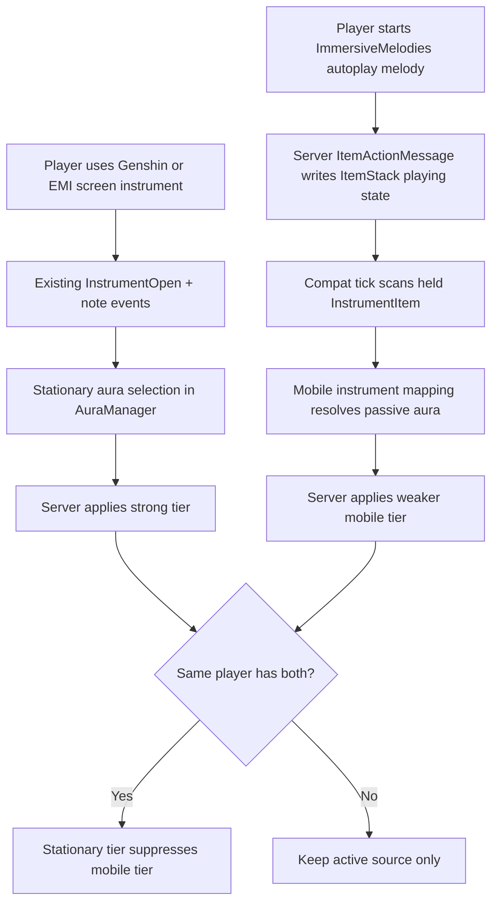
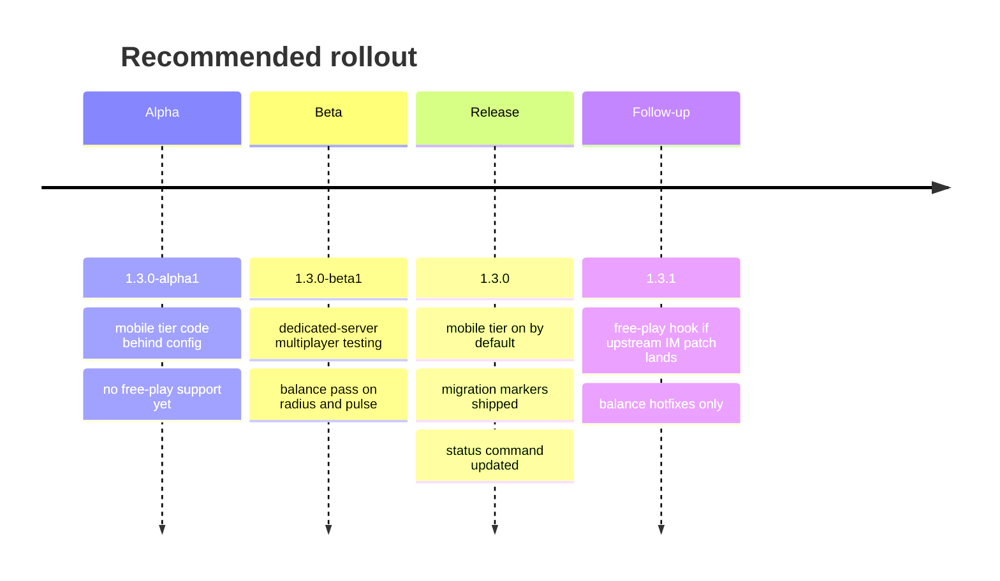

# Dual-tier instrument buff compatibility plan for EffectiveInstruments and ImmersiveMelodies

## Executive summary

The cleanest implementation is to keep the current strong, screen-driven aura system in `EffectiveInstruments` for the stationary tier, and add a second, optional, server-authoritative passive tier that activates from `ImmersiveMelodies` instruments when the mod is present. That means **no rewrite of the existing Genshin Instruments path**, no trust in client note packets for buff authority, and no mandatory dependency on `ImmersiveMelodies`. `EffectiveInstruments` already has the right primitives: a server tick loop, data-driven aura presets, instrument-to-aura mappings, command reloads, and packet-backed state sync for the stationary path. `ImmersiveMelodies` already stores playback state on the server-side `InstrumentItem` stack and ticks those instruments every world tick, which makes it a strong anchor for an optional mobile/passive buff path. fileciteturn12file0L1-L1 fileciteturn19file0L1-L1 fileciteturn22file0L1-L1 fileciteturn40file0L1-L1 fileciteturn59file0L1-L1 fileciteturn60file0L1-L1

The implementation below is scoped to **Minecraft 1.20.1 on Forge**. `EffectiveInstruments` is currently a Forge mod for 1.20.1 and depends on Genshin Instruments, with Even More Instruments as an optional soft dependency; `ImmersiveMelodies` targets 1.20.1 too, but uses an Architectury common/Forge/Fabric layout, so the compatibility work should live on the Forge side of `EffectiveInstruments` and treat the `ImmersiveMelodies` branch inspected here as the source of truth for class names and playback behavior. fileciteturn30file0L1-L1 fileciteturn31file0L1-L1 fileciteturn36file0L1-L1 fileciteturn37file0L1-L1 fileciteturn62file0L1-L1

My recommendation is to ship this as **EffectiveInstruments 1.3.0**, because it adds new behavior, new config surfaces, and new migration markers, but it does **not** require a network protocol bump if you keep the mobile tier fully server-side and reuse vanilla mob effect sync. The current `EffectiveInstruments` network protocol is version `3`, and nothing in the plan below requires a new custom packet unless you later decide to add client-only mobile-tier HUD state. fileciteturn15file0L1-L1 fileciteturn32file0L1-L1

There is one important caveat. `EffectiveInstruments` is currently MIT-licensed, while `ImmersiveMelodies` declares GPL-3.0-only in its Forge metadata and GPLv3 on CurseForge. That does **not** block engineering work, but it does mean you should treat a tightly linked compatibility build as a licensing review item. The safest engineering posture is either a reflection-based bridge with no copied source, or an optional compat submodule/addon jar whose distribution terms you review separately. This is an engineering risk note, not legal advice. fileciteturn8file0L1-L1 fileciteturn62file0L1-L1 citeturn10search0turn10search3

## What the two codebases already do

### EffectiveInstruments

`EffectiveInstruments` is already structured like a textbook Forge-side status-effect service. The mod entrypoint registers server and client TOML configs, particles, command registration, packet initialization, and aura registry loading from `commonSetup`. Aura definitions are loaded from JSON files under `config/effective_instruments/auras`, instrument-to-aura mappings are loaded from `instrument_auras.json`, and `/effectiveinstruments reload` reloads both presets and mappings. The main server behavior lives in `AuraManager`: it tracks selected aura, current instrument id, instrument-open state, recent note activity, and affected targets; it then refreshes effects on a fixed server tick interval and clears stale effects safely when a musician switches, closes, dies, logs out, or changes dimension. fileciteturn11file0L1-L1 fileciteturn21file0L1-L1 fileciteturn19file0L1-L1 fileciteturn12file0L1-L1 fileciteturn14file0L1-L1 fileciteturn27file0L1-L1

The stationary tier is already wired exactly where it should be. `NoteActivityHandler` listens to `InstrumentPlayedEvent` from Genshin Instruments and updates server note activity; `InstrumentStateHandler` listens to `InstrumentOpenStateChangedEvent` and level ticks; `AuraOverlayInjector` injects the selector into `InstrumentScreen` instances and sends `InstrumentOpenC2SPacket` plus `SelectAuraC2SPacket`; `SyncAuraSelectionS2CPacket` reflects server default selection back to the client overlay. This path is server-authoritative and should remain the strong tier untouched except for minor generalization so it can coexist with a second source. fileciteturn13file0L1-L1 fileciteturn14file0L1-L1 fileciteturn23file0L1-L1 fileciteturn15file0L1-L1 fileciteturn16file0L1-L1 fileciteturn17file0L1-L1 fileciteturn18file0L1-L1

Just as important: the current data model is already close to what you need. `AuraPreset` exposes id, display text, effects, color, duration, radius override, enable flag, sort order, and optional icon textures. That is strong enough to keep the current stationary tier unchanged and to host a mobile tier later with one small schema extension, rather than inventing a second parallel “buff definition” format. fileciteturn20file0L1-L1

### ImmersiveMelodies

`ImmersiveMelodies` is a multi-loader mod with common code and Forge/Fabric entrypoints. The mod id is `immersive_melodies`. Instruments are registered in `immersive_melodies.Items`, and each instrument is an `InstrumentItem`. Right-clicking an instrument opens a selector GUI on the server side, and actual song playback state is stored in the ItemStack NBT using tags like `playing`, `melody`, `start_time`, and `enabled_tracks`. The instrument then plays on both client and server through per-entity ticking, because `ClientWorldMixin` and `ServerWorldMixin` call `inventoryClientTick` and `inventoryServerTick` for held `InstrumentItem`s every tick. That is the core reason this mod is a good fit for a **mobile passive tier**: the authoritative “is actively performing a melody” state already exists on the server-owned item stack. fileciteturn62file0L1-L1 fileciteturn43file0L1-L1 fileciteturn40file0L1-L1 fileciteturn59file0L1-L1 fileciteturn60file0L1-L1

The other major integration point is the play/pause protocol. `ItemActionMessage` is what flips the server-side `InstrumentItem` between `PLAY`, `CONTINUE`, and `PAUSE`, and `InstrumentItem.play(...)` writes the melody id, `playing` flag, and start time directly to the stack tag. Because of that, the safest compatibility strategy is **not** to infer buffs from audio packets, but to inspect the held stack server-side and ask whether the instrument is in its playing state. That is much more robust in multiplayer. fileciteturn49file0L1-L1 fileciteturn40file0L1-L1

There is one trap hiding in plain sight. `ImmersiveMelodies` also supports free-play keyboard/MIDI note input. In that path, `ImmersiveMelodiesFreePlayingScreen` calls `Client.playNote(...)`, and `Client.playNote(...)` emits `NoteBroadcastRequest` to nearby players while pausing an already-playing autoplay melody if necessary. That means **free-play note input is not reliably represented by the `InstrumentItem.playing` flag**. So a pure `EffectiveInstruments`-side, no-upstream-patch implementation can cover **autoplay / selected melody playback** cleanly, but not full free-play note-stream support. If you want mobile buffs during free-play too, you need a tiny upstream hook in `ImmersiveMelodies` or a mixin-based bridge. fileciteturn68file0L1-L1 fileciteturn39file0L1-L1 fileciteturn47file0L1-L1

The repository also shows why multiplayer testing matters. `ImmersiveMelodies` 0.6.0 explicitly fixed direct playback in multiplayer, while earlier releases fixed dedicated server crashes and desync issues. So the compatibility design should lean into the strongest current invariant—server-side item state—rather than trying to follow every individual note packet as the source of truth. fileciteturn61file0L1-L1 citeturn10search0

## Recommended integration architecture

The recommended architecture is a **dual-source, single-registry** model:

- **Stationary tier**: keep the current `EffectiveInstruments` aura path for Genshin Instruments and Even More Instruments exactly where it is.
- **Mobile tier**: add a second optional activator for `ImmersiveMelodies`, driven by held `InstrumentItem` playback state and a separate mobile instrument-to-aura mapping.
- **Shared aura registry**: continue using one aura/preset registry, but tag presets as `stationary`, `mobile`, or both, and keep mobile-only presets out of the selector UI.
- **Server authority**: mobile buffs are applied by the server tick loop after checking the server-side item state; vanilla effect sync handles clients.
- **Precedence**: if both tiers could ever apply to the same player, the stationary tier wins and suppresses the mobile tier. That avoids degenerate stacking. This precedence rule is an intentional design recommendation, not something present in the current code. The current stationary path already uses strongest-wins effect application and target cleanup, which makes it a good base for this extension. fileciteturn12file0L1-L1 fileciteturn19file0L1-L1 fileciteturn20file0L1-L1



That flow is grounded in how `EffectiveInstruments` already listens to instrument open/play state, how `ImmersiveMelodies` already stores playback on `InstrumentItem`, and how Forge mods declare optional dependencies in `mods.toml`. Forge’s mod metadata system supports optional dependencies, and Forge’s `ModList` exposes `isLoaded(String)` for runtime detection, which is the right runtime gate here. fileciteturn13file0L1-L1 fileciteturn14file0L1-L1 fileciteturn40file0L1-L1 fileciteturn49file0L1-L1 citeturn7search1turn8search1

I strongly recommend a **reflection-based runtime bridge** instead of a hard Java import of `immersive_melodies.item.InstrumentItem` in core classes. The reason is brutally practical: `EffectiveInstruments` currently has no `ImmersiveMelodies` dependency, uses optional dependency patterns already for other instrument mods, and should not risk `NoClassDefFoundError` on servers where `ImmersiveMelodies` is absent. Reflection also keeps the compat code isolated, which is healthier both technically and from a distribution-risk standpoint. `EffectiveInstruments` already advertises “no mixins, no reflection” for its current Genshin path, but the optional IM bridge is exactly the kind of narrow, quarantined place where reflection is justified. fileciteturn8file0L1-L1 fileciteturn30file0L1-L1 fileciteturn31file0L1-L1

## Exact implementation plan for Claude Code

### Files to add

Add these new files to `otectus/EffectiveInstruments`:

- `src/main/java/com/crims/effectiveinstruments/aura/BuffTier.java`
- `src/main/java/com/crims/effectiveinstruments/aura/MobileInstrumentAuraMapping.java`
- `src/main/java/com/crims/effectiveinstruments/aura/AuraApplicator.java`
- `src/main/java/com/crims/effectiveinstruments/compat/immersivemelodies/ImmersiveMelodiesCompat.java`
- `src/main/java/com/crims/effectiveinstruments/compat/immersivemelodies/ImmersiveMelodiesAuraHandler.java`
- `src/test/java/com/crims/effectiveinstruments/aura/MobileInstrumentAuraMappingJsonTest.java`
- `src/test/java/com/crims/effectiveinstruments/aura/AuraTierJsonTest.java`

Those additions mirror the existing split between registry, mapping, and runtime handlers in the current codebase, instead of dumping everything into `AuraManager`. That keeps the stationary path readable and gives the mobile tier a clean quarantine zone. fileciteturn10file4L1-L1 fileciteturn10file13L1-L1 fileciteturn10file22L1-L1 fileciteturn28file0L1-L1

### Files to edit

Edit these existing files:

- `src/main/resources/META-INF/mods.toml`
- `src/main/java/com/crims/effectiveinstruments/EffectiveInstrumentsMod.java`
- `src/main/java/com/crims/effectiveinstruments/aura/AuraPreset.java`
- `src/main/java/com/crims/effectiveinstruments/aura/AuraJsonLoader.java`
- `src/main/java/com/crims/effectiveinstruments/aura/AuraRegistry.java`
- `src/main/java/com/crims/effectiveinstruments/aura/InstrumentAuraMapping.java`
- `src/main/java/com/crims/effectiveinstruments/config/EIServerConfig.java`
- `src/main/java/com/crims/effectiveinstruments/event/InstrumentStateHandler.java`
- `src/main/java/com/crims/effectiveinstruments/command/EICommands.java`
- `src/main/resources/assets/effectiveinstruments/lang/en_us.json` fileciteturn11file0L1-L1 fileciteturn20file0L1-L1 fileciteturn21file0L1-L1 fileciteturn22file0L1-L1 fileciteturn19file0L1-L1 fileciteturn25file0L1-L1 fileciteturn14file0L1-L1 fileciteturn27file0L1-L1 fileciteturn65file0L1-L1

### Add optional mod metadata and runtime detection

Add an optional dependency entry to `mods.toml`, following the same pattern the mod already uses for `evenmoreinstruments`:

```toml
[[dependencies.${mod_id}]]
    modId="immersive_melodies"
    mandatory=false
    versionRange="[0,)"
    ordering="AFTER"
    side="BOTH"
```

That is the correct metadata-level signal that compat is optional, and it aligns with Forge’s dependency model and with how `EffectiveInstruments` already advertises optional EMI support. fileciteturn31file0L1-L1 citeturn7search1

Then initialize the runtime bridge in `EffectiveInstrumentsMod.commonSetup()`:

```java
private void commonSetup(final FMLCommonSetupEvent event) {
    event.enqueueWork(() -> {
        EIPacketHandler.register();
        AuraRegistry.load();
        ImmersiveMelodiesCompat.init();   // new
    });
}
```

### Add tier support to aura presets

The least destructive schema change is to extend `AuraPreset` with a tier set and selector visibility flag, while keeping all old files valid by defaulting them to stationary-enabled and selector-visible. This avoids creating a second parallel registry format and preserves the existing JSON model. The current preset record is already small and data-driven, so extending it is the right move. fileciteturn20file0L1-L1 fileciteturn21file0L1-L1

Use this addition:

```java
// src/main/java/com/crims/effectiveinstruments/aura/BuffTier.java
package com.crims.effectiveinstruments.aura;

public enum BuffTier {
    STATIONARY,
    MOBILE
}
```

```java
// edit AuraPreset.java
public record AuraPreset(
        String id,
        Component displayName,
        Component description,
        int color,
        List<EffectEntry> effects,
        int defaultDurationTicks,
        int radiusOverride,
        boolean enabled,
        int sortOrder,
        @Nullable ResourceLocation iconTexture,
        @Nullable ResourceLocation selectedIconTexture,
        Set<BuffTier> supportedTiers,
        boolean showInSelector
) {
    public boolean supports(BuffTier tier) {
        return supportedTiers.contains(tier);
    }
    // keep existing getEffectiveRadius/getEffectiveDuration
}
```

In `AuraJsonLoader.parseFile(...)`, parse two optional fields:

```java
Set<BuffTier> tiers = EnumSet.of(BuffTier.STATIONARY);
if (root.has("tiers") && root.get("tiers").isJsonArray()) {
    tiers = EnumSet.noneOf(BuffTier.class);
    for (JsonElement elem : root.getAsJsonArray("tiers")) {
        String raw = elem.getAsString().trim().toLowerCase(Locale.ROOT);
        switch (raw) {
            case "stationary" -> tiers.add(BuffTier.STATIONARY);
            case "mobile" -> tiers.add(BuffTier.MOBILE);
        }
    }
    if (tiers.isEmpty()) tiers = EnumSet.of(BuffTier.STATIONARY);
}

boolean showInSelector = root.has("showInSelector")
        ? root.get("showInSelector").getAsBoolean()
        : tiers.contains(BuffTier.STATIONARY);
```

Then build the record with those fields. Finally, in `InstrumentAuraMapping.getAllowedAuras(...)`, filter to stationary presets only:

```java
.filter(AuraPreset::enabled)
.filter(preset -> preset.supports(BuffTier.STATIONARY))
.filter(AuraPreset::showInSelector)
```

That one filter line prevents mobile-only passive presets from polluting the existing screen overlay. fileciteturn19file0L1-L1 fileciteturn23file0L1-L1

### Add a dedicated mobile instrument mapping loader

Do **not** overload the existing `instrument_auras.json`. That file is already the stationary selector’s contract. Instead, add `MobileInstrumentAuraMapping.java` and generate `config/effective_instruments/mobile_instrument_auras.json` with its own migration marker. Using a second marker file matters because `AuraJsonLoader` and `InstrumentAuraMapping` both use “generate defaults once” marker semantics today; existing installations will otherwise never get your new passive defaults. fileciteturn21file0L1-L1 fileciteturn19file0L1-L1

Recommended shape:

```java
public final class MobileInstrumentAuraMapping {
    private static final Gson GSON = new GsonBuilder().setPrettyPrinting().create();
    private static final Map<ResourceLocation, String> MAPPINGS = new HashMap<>();

    public static void ensureDefaults() { /* new marker: .mobile_defaults_generated */ }
    public static void load() { /* parse simple string map */ }

    @Nullable
    public static AuraPreset resolve(ResourceLocation instrumentId) {
        String auraId = MAPPINGS.get(instrumentId);
        if (auraId == null) return null;
        return AuraRegistry.getById(auraId)
                .filter(AuraPreset::enabled)
                .filter(p -> p.supports(BuffTier.MOBILE))
                .orElse(null);
    }
}
```

### Add a reflection-based ImmersiveMelodies bridge

This file is the heart of the runtime fallback requirement. The bridge should be the **only** place that even knows `immersive_melodies.item.InstrumentItem` exists.

```java
package com.crims.effectiveinstruments.compat.immersivemelodies;

import com.crims.effectiveinstruments.EffectiveInstrumentsMod;
import net.minecraft.resources.ResourceLocation;
import net.minecraft.server.level.ServerPlayer;
import net.minecraft.world.item.Item;
import net.minecraft.world.item.ItemStack;
import net.minecraftforge.fml.ModList;
import net.minecraftforge.registries.ForgeRegistries;

import javax.annotation.Nullable;
import java.lang.reflect.Method;

public final class ImmersiveMelodiesCompat {
    public static final String MODID = "immersive_melodies";
    private static final String INSTRUMENT_ITEM_CLASS = "immersive_melodies.item.InstrumentItem";

    private static boolean available = false;
    private static Class<?> instrumentItemClass;
    private static Method isPlayingMethod;

    public static void init() {
        available = ModList.get().isLoaded(MODID);
        if (!available) return;

        try {
            instrumentItemClass = Class.forName(INSTRUMENT_ITEM_CLASS);
            isPlayingMethod = instrumentItemClass.getMethod("isPlaying", ItemStack.class);
            EffectiveInstrumentsMod.LOGGER.info("Immersive Melodies compat enabled");
        } catch (ReflectiveOperationException e) {
            available = false;
            EffectiveInstrumentsMod.LOGGER.warn("Immersive Melodies detected, but compat bridge failed", e);
        }
    }

    public static boolean isAvailable() {
        return available;
    }

    public static boolean isImmersiveInstrument(ItemStack stack) {
        return available && instrumentItemClass != null && instrumentItemClass.isInstance(stack.getItem());
    }

    public static boolean isPlaying(ItemStack stack) {
        if (!isImmersiveInstrument(stack) || isPlayingMethod == null) return false;
        try {
            return (boolean) isPlayingMethod.invoke(stack.getItem(), stack);
        } catch (ReflectiveOperationException e) {
            return false;
        }
    }

    @Nullable
    public static ItemStack findActiveInstrument(ServerPlayer player) {
        for (ItemStack stack : player.getHandSlots()) {
            if (isPlaying(stack)) return stack;
        }
        return null;
    }

    @Nullable
    public static ResourceLocation getInstrumentId(ItemStack stack) {
        Item item = stack.getItem();
        return ForgeRegistries.ITEMS.getKey(item);
    }

    private ImmersiveMelodiesCompat() {}
}
```

That gives you runtime detection, graceful fallback, and no hard class loading when the mod is absent. Forge’s `ModList.isLoaded(String)` is the correct runtime gate for this pattern. citeturn8search1

### Reuse the existing effect logic through a shared applicator

The current effect logic in `AuraManager` is good, but it is too stationary-specific. Extract the effect application and cleanup logic into a new helper, `AuraApplicator`, so both tiers can use the same “strongest wins”, tracked-target cleanup, and target gathering behavior. Current `AuraManager` already implements those semantics; you are just moving them into a reusable home. fileciteturn12file0L1-L1

Skeleton:

```java
public record TargetingProfile(
        boolean allowSelf,
        boolean includeOtherPlayers,
        boolean includeTamedPets
) {}

public final class AuraApplicator {
    public static void apply(
            ServerPlayer source,
            AuraPreset aura,
            TargetingProfile profile,
            Map<Integer, Set<MobEffect>> affectedTargets
    ) { /* extract from AuraManager.applyAuraEffects + gatherTargets */ }

    public static void clear(
            ServerPlayer source,
            @Nullable AuraPreset aura,
            Map<Integer, Set<MobEffect>> affectedTargets,
            int intervalGraceTicks
    ) { /* extract from AuraManager.clearPreviousAuraEffects */ }
}
```

Then leave the current `AuraManager` mostly intact and replace its internal direct calls with `AuraApplicator.apply(...)` / `AuraApplicator.clear(...)`.

### Add the mobile tier handler

Create `ImmersiveMelodiesAuraHandler.java` and wire it from `InstrumentStateHandler.onLevelTick(...)` after the existing stationary tick:

```java
public final class ImmersiveMelodiesAuraHandler {
    private static final Map<UUID, MobileAuraState> STATES = new HashMap<>();

    public static void onServerTick(ServerLevel level) {
        if (!ImmersiveMelodiesCompat.isAvailable()) return;
        if (!EIServerConfig.MOBILE_TIER_ENABLED.get()) return;

        long gameTime = level.getGameTime();
        int pulse = EIServerConfig.MOBILE_PULSE_INTERVAL_TICKS.get();
        if (gameTime % pulse != 0) return;

        for (ServerPlayer player : level.players()) {
            tickPlayer(level, player, gameTime);
        }
    }

    private static void tickPlayer(ServerLevel level, ServerPlayer player, long gameTime) {
        MobileAuraState state = STATES.computeIfAbsent(player.getUUID(), id -> new MobileAuraState());

        if (EIServerConfig.SUPPRESS_MOBILE_WHEN_STATIONARY_ACTIVE.get()
                && AuraManager.isActive(player.getUUID(), gameTime)) {
            clear(player, state);
            return;
        }

        ItemStack active = ImmersiveMelodiesCompat.findActiveInstrument(player);
        if (active == null) {
            expireOrClear(player, state, gameTime);
            return;
        }

        ResourceLocation instrumentId = ImmersiveMelodiesCompat.getInstrumentId(active);
        if (instrumentId == null) {
            expireOrClear(player, state, gameTime);
            return;
        }

        AuraPreset aura = MobileInstrumentAuraMapping.resolve(instrumentId);
        if (aura == null) {
            expireOrClear(player, state, gameTime);
            return;
        }

        // switch cleanup
        if (state.activeAura != null && !state.activeAura.id().equals(aura.id())) {
            AuraApplicator.clear(player, state.activeAura, state.affectedTargets,
                    EIServerConfig.MOBILE_PULSE_INTERVAL_TICKS.get());
            state.affectedTargets.clear();
        }

        state.activeAura = aura;
        state.instrumentId = instrumentId;
        state.lastActiveTick = gameTime;

        AuraApplicator.apply(
                player,
                aura,
                new TargetingProfile(
                        EIServerConfig.MOBILE_ALLOW_SELF_BUFF.get(),
                        EIServerConfig.MOBILE_INCLUDE_OTHER_PLAYERS.get(),
                        EIServerConfig.MOBILE_INCLUDE_TAMED_PETS.get()
                ),
                state.affectedTargets
        );
    }
}
```

You will also need a tiny bridge method in `AuraManager`:

```java
public static boolean isActive(UUID playerId, long currentGameTime) {
    PlayerAuraState state = PLAYER_STATES.get(playerId);
    return state != null && state.isActive(currentGameTime);
}
```

And then in `InstrumentStateHandler.onLevelTick(...)`:

```java
AuraManager.onServerTick(serverLevel);
ImmersiveMelodiesAuraHandler.onServerTick(serverLevel);
```

Also forward logout, dimension change, and death cleanup events to the new handler the same way the mod already does for `AuraManager`. That keeps lifecycle symmetry with the existing stationary logic. fileciteturn14file0L1-L1

### Add the server config surface

Add a new `mobileTier` section to `EIServerConfig`:

```java
builder.comment("Immersive Melodies mobile passive tier").push("mobileTier");
MOBILE_TIER_ENABLED = builder.define("enabled", true);
MOBILE_PULSE_INTERVAL_TICKS = builder.defineInRange("pulseIntervalTicks", 20, 5, 100);
MOBILE_LINGER_TICKS = builder.defineInRange("lingerTicks", 60, 0, 200);
MOBILE_DEFAULT_RADIUS = builder.defineInRange("defaultRadius", 8, 1, 32);
MOBILE_ALLOW_SELF_BUFF = builder.define("allowSelfBuff", true);
MOBILE_INCLUDE_OTHER_PLAYERS = builder.define("includeOtherPlayers", true);
MOBILE_INCLUDE_TAMED_PETS = builder.define("includeTamedPets", false);
SUPPRESS_MOBILE_WHEN_STATIONARY_ACTIVE = builder.define("suppressWhenStationaryActive", true);
builder.pop();
```

For the actual radius, either let mobile presets specify `radius`, or if they use `-1`, have the mobile handler use `MOBILE_DEFAULT_RADIUS` instead of the stationary global `DEFAULT_RADIUS`. The cleanest way is to add a helper to the mobile handler that interprets `-1` against the mobile default instead of the stationary one. The current `AuraPreset.getEffectiveRadius()` only knows the stationary global default, so do **not** blindly reuse it for mobile if you want separately tunable radii. fileciteturn20file0L1-L1 fileciteturn25file0L1-L1

### Update commands and status output

Extend `/effectiveinstruments status` to include mobile state. Right now it reports stationary aura, current instrument, open state, and buffed target count. Add these keys too:

- `command.effectiveinstruments.status.mobile_aura`
- `command.effectiveinstruments.status.mobile_instrument`
- `command.effectiveinstruments.status.mobile_active`

That gives admins immediate visibility when debugging dedicated server behavior. Current command and localization plumbing already exists, so this is a low-risk edit. fileciteturn27file0L1-L1 fileciteturn65file0L1-L1

### Optional phase-two patch in ImmersiveMelodies for free-play support

If you want passive buffs while using the free-play keyboard/MIDI mode too, add a tiny upstream hook in `ImmersiveMelodies` instead of trying to reverse-engineer it from `EffectiveInstruments`. The minimal change is in `common/src/main/java/immersive_melodies/network/c2s/NoteBroadcastRequest.java`, right before the current nearby-player rebroadcast:

```java
// in ImmersiveMelodies
ServerPlaybackHooks.fire(se, tone, velocity);
```

Then add a tiny common API:

```java
package immersive_melodies.api;

import net.minecraft.server.level.ServerPlayer;

public interface ServerNoteListener {
    void onServerNote(ServerPlayer player, int tone, int velocity);
}
```

and a `ServerPlaybackHooks` registry class. If you do this, `EffectiveInstruments` can update `lastMobileActiveTick` for free-play note streams too. Without this IM-side patch, I recommend documenting that **mobile buffs cover autoplay / selected melody playback only**. fileciteturn47file0L1-L1 fileciteturn68file0L1-L1

## Configuration and balance defaults

### Recommended default tier matrix

The table below is the balance recommendation I would actually ship first. The stationary column is aligned with the current EffectiveInstruments cadence and radius defaults; the mobile column is intentionally lighter in both power and server cost. The performance-cost row is an engineering inference from the current entity-query shape in `AuraManager`: halving radius from 16 to 8 cuts the search volume by roughly 8x, and doubling the pulse interval from 10 ticks to 20 ticks halves scan cadence again. fileciteturn12file0L1-L1 fileciteturn25file0L1-L1

| Dimension | Stationary tier | Mobile tier |
|---|---:|---:|
| Activation source | Genshin / EMI screen play | Immersive Melodies autoplay play-state |
| UI | Existing selector overlay | No selector in MVP, config-driven |
| Effect budget | 1–2 full effects | Usually 1 primary effect, rarely 1 utility secondary |
| Recommended duration | 160–260 ticks | 60 ticks |
| Recommended pulse / cooldown | 10 ticks | 20 ticks |
| Recommended radius | 16 blocks | 8 blocks |
| Recommended targets | self + other players + pets | self + other players, pets off by default |
| Combat economy effects | allowed if already present | exclude `hero_of_the_village`, avoid `absorption II`, avoid `strength + resistance` pairs |
| Precedence | highest | suppressed if stationary is active |
| Estimated server cost per active musician | baseline/current | about an order of magnitude lower in practice |

### Recommended passive aura set for ImmersiveMelodies

I would start with **single-effect** passives for the mobile tier. That keeps the system readable, avoids power-creep while moving, and makes server-side balance tuning dramatically easier.

| Immersive Melodies instrument id | Recommended passive aura id | Recommended effect | Duration | Pulse | Radius |
|---|---|---|---:|---:|---:|
| `immersive_melodies:flute` | `windstep_mobile` | Speed I | 60 | 20 | 8 |
| `immersive_melodies:lute` | `traveler_hum_mobile` | Luck I | 60 | 20 | 8 |
| `immersive_melodies:piano` | `measured_tempo_mobile` | Haste I | 60 | 20 | 8 |
| `immersive_melodies:vielle` | `hearthsong_mobile` | Regeneration I | 60 | 20 | 6 |
| `immersive_melodies:didgeridoo` | `earthpulse_mobile` | Jump Boost I | 60 | 20 | 8 |
| `immersive_melodies:bagpipe` | `steadfast_drone_mobile` | Resistance I | 60 | 20 | 6 |
| `immersive_melodies:trumpet` | `brass_call_mobile` | Strength I | 40 | 20 | 5 |
| `immersive_melodies:tiny_drum` | `march_tap_mobile` | Speed I | 60 | 20 | 8 |
| `immersive_melodies:triangle` | `clear_ping_mobile` | Night Vision | 100 | 20 | 8 |
| `immersive_melodies:handpan` | `stillwater_mobile` | Water Breathing | 100 | 20 | 8 |
| `immersive_melodies:ender_bass` | `shade_resonance_mobile` | Fire Resistance | 80 | 20 | 6 |

### Sample `mobile_instrument_auras.json`

```json
{
  "_comment": "Maps Immersive Melodies instrument item IDs to mobile-tier passive aura IDs. Reload with /effectiveinstruments reload.",
  "immersive_melodies:flute": "windstep_mobile",
  "immersive_melodies:lute": "traveler_hum_mobile",
  "immersive_melodies:piano": "measured_tempo_mobile",
  "immersive_melodies:vielle": "hearthsong_mobile",
  "immersive_melodies:didgeridoo": "earthpulse_mobile",
  "immersive_melodies:bagpipe": "steadfast_drone_mobile",
  "immersive_melodies:trumpet": "brass_call_mobile",
  "immersive_melodies:tiny_drum": "march_tap_mobile",
  "immersive_melodies:triangle": "clear_ping_mobile",
  "immersive_melodies:handpan": "stillwater_mobile",
  "immersive_melodies:ender_bass": "shade_resonance_mobile"
}
```

### Sample mobile aura preset

```json
{
  "displayName": "Windstep",
  "description": "A light melody that keeps nearby allies nimble while on the move",
  "color": "7FDBCA",
  "enabled": true,
  "tiers": ["mobile"],
  "showInSelector": false,
  "durationTicks": 60,
  "radius": -1,
  "sortOrder": 200,
  "effects": [
    { "effect": "minecraft:speed", "amplifier": 0 }
  ]
}
```

### Sample server config additions

```toml
[mobileTier]
enabled = true
pulseIntervalTicks = 20
lingerTicks = 60
defaultRadius = 8
allowSelfBuff = true
includeOtherPlayers = true
includeTamedPets = false
suppressWhenStationaryActive = true
```

### Sample localization additions

```json
{
  "command.effectiveinstruments.status.mobile_aura": "Mobile Aura: %s",
  "command.effectiveinstruments.status.mobile_instrument": "Mobile Instrument: %s",
  "command.effectiveinstruments.status.mobile_active": "Mobile Buff Active: %s",
  "command.effectiveinstruments.status.mobile_none": "No mobile performance state for this player",
  "tooltip.effectiveinstruments.tier.stationary": "Stationary tier",
  "tooltip.effectiveinstruments.tier.mobile": "Mobile tier",
  "tooltip.effectiveinstruments.compat.immersive_melodies": "Immersive Melodies compatibility active"
}
```

## Testing, migration, and rollout

### Unit and integration tests

`EffectiveInstruments` already has JUnit 5 wired in `build.gradle`, and it already uses a JSON-focused parsing test for instrument-aura mappings. Follow that pattern first for schema safety, then add Forge integration tests or GameTests for runtime behavior. fileciteturn30file0L1-L1 fileciteturn28file0L1-L1

Add these **unit tests**:

- `AuraTierJsonTest`
  - old aura JSON with no `tiers` parses as `STATIONARY`
  - mobile aura JSON with `tiers: ["mobile"]` parses correctly
  - `showInSelector` defaults to `true` for stationary, `false` only when explicitly set or when stationary tier absent
- `MobileInstrumentAuraMappingJsonTest`
  - valid IM item id → valid aura id loads
  - unknown aura ids are skipped with warning
  - invalid resource locations are skipped
- `ImmersiveMelodiesCompatNoopTest`
  - when `ModList.isLoaded("immersive_melodies")` is false, bridge returns unavailable and no active instrument
- `AuraApplicatorSelectionTest`
  - strongest-wins logic still does not downgrade stronger existing effect
  - tracked cleanup removes only expected short-duration, matching-amplifier effects

Then add **integration / GameTest cases**:

- stationary GI path still works unchanged
- IM autoplay melody grants mobile tier after one pulse interval
- stationary tier suppresses mobile tier when both are active
- pausing IM melody clears buffs after `lingerTicks`
- dimension change and logout clear mobile tracked targets
- config reload updates mobile mapping without restart
- dedicated server with IM absent starts cleanly and applies no mobile path
- dedicated server with IM present and mismatch-free client sees buffs on nearby players

### Manual QA checklist

Run this exact QA pass before calling the feature done:

- Start a Forge 1.20.1 dedicated server with only `EffectiveInstruments`; verify no startup warnings beyond “compat unavailable,” and verify all existing stationary auras behave exactly as before. fileciteturn31file0L1-L1 fileciteturn32file0L1-L1
- Add `ImmersiveMelodies 0.6.0` Forge and verify startup succeeds with compat enabled. citeturn10search0
- Play a normal GI instrument in the selector overlay and verify the current packets and UI still synchronize correctly. fileciteturn15file0L1-L1 fileciteturn23file0L1-L1
- Start an IM melody from the selector GUI, close the GUI, walk around, and verify the mobile buff appears after the configured pulse.
- Pause the IM melody and verify effects linger exactly `lingerTicks` and then clear.
- Keep two players close together and verify the nearby ally receives the mobile effect and that the musician receives self-buff only if enabled.
- Verify tamed pets do **not** receive mobile buffs by default.
- Trigger a stronger vanilla effect source, then verify mobile/stationary effects do not downgrade it.
- Switch from IM mobile performance to a GI stationary performance and verify stationary suppression of mobile effects.
- Change dimensions, log out, die, and reconnect while a buff is active; verify tracked targets are cleared.
- Use the free-play keyboard mode and verify the currently documented behavior: either no passive buff in MVP, or passive buff if you implemented the optional IM hook.
- Run `/effectiveinstruments reload` and `/effectiveinstruments status <player>` and verify mobile state reporting and config reload behavior.

### Migration and upgrade steps

The migration plan needs two separate tracks because the current default generators are marker-based:

First, preserve backward compatibility for **existing stationary aura JSONs** by making the new `tiers` and `showInSelector` properties optional with safe defaults. Existing files should continue to load without edits as stationary-only presets. That keeps old servers stable. fileciteturn21file0L1-L1

Second, add **new marker files** for the new passive resources. Do not reuse `.defaults_generated` or `.instrument_defaults_generated`. Existing installs will otherwise never get your new passive defaults because the current generators are intentionally one-shot. Use separate markers such as:

- `config/effective_instruments/.mobile_aura_defaults_generated`
- `config/effective_instruments/.mobile_instrument_defaults_generated`

That migration detail is non-negotiable; skipping it is the classic “works on fresh install, silently missing on upgraded servers” disaster. fileciteturn21file0L1-L1 fileciteturn19file0L1-L1

### Rollout plan and versioning

Use this rollout sequence:



I would keep the **custom network protocol version at `3`** for the initial release because the MVP design adds no required new packets; vanilla effect sync and server-side item-state scanning are enough. If you later add explicit client HUD sync for the mobile tier, then bump the protocol to `4` and note the incompatibility clearly in the changelog. fileciteturn15file0L1-L1

The release target should be **EffectiveInstruments 1.3.0**. That is large enough to justify a minor version bump from the currently documented 1.2.1 state, but not large enough to justify a breaking major version unless you choose to hard-link or relicense distribution around the compatibility layer. fileciteturn32file0L1-L1